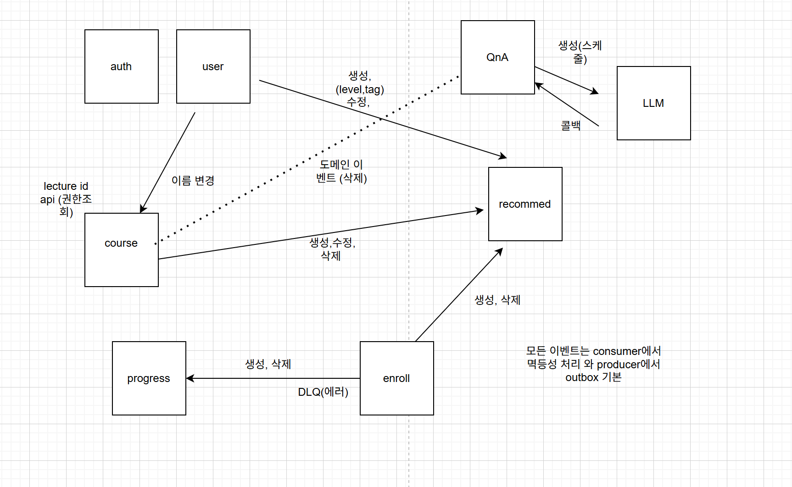

## 🥑 들어가며

5번째 달엔 AI를 붙여서 프로젝트를 확장하는 작업을 진행하였다. 개발 기간이 2주로 살짝 짧았지만, 4개월차까지 진행하면서 약간의 리팩토링 작업도 함께 진행하였다. 이후 약 1달간 최종 프로젝트 진행 + 면접 + 이사 + 취업으로 회고가 많이 늦춰졌다. 그래서 뒤늦게 회고를 적게 되었다.

 

## 📚 5개월차: 리팩토링과 AI

5개월차엔 팀 인원이 총 2명으로 줄었기 때문에 각자 할 업무가 많이 늘 수밖에 없었다. 처음에 계획했던 업무는 다음과 같다. 전체적으로 이벤트 설계를 다시 해야 했기에 시간이 급했다.

- recommend 고도화
- spring-recommend 배치 -> redis 캐싱
- 파일 서빙(이미지, 영상)
- QnA 답변 LLM (프롬프트 - 강의제목, tag, section title 기반)

또한 나의 경우에는 4개월차에 적용시켰던 passport라는 정책의 보일러 플레이트를 제거하기 위해 라이브러리를 배포해야 했다. 아래 이미지는 이벤트 설계를 하면서 전체적으로 구상해둔 것이다.

당시에 이벤트가 적용되어 있던 도메인이 user와 course만 존재했던 것으로 기억한다. 나머지 도메인에 적용이 되어있지 않았기 때문에 우선 이벤트를 적용시키는 것부터 나눠서 진행하였다. 마지막으로 나에게 할당됐던 업무는 아래와 같다.

- enrollment 이벤트 적용
- passport 라이브러리 전체 적용
- QNA 도메인 구현
- 파일 서빙(이미지, 영상)
- QnA 답변 LLM (프롬프트 - 강의제목, tag, section title 기반)

모든 업무를 다 끝내긴 했지만 5개월차의 주제가 AI이기 때문에 LLM 서버를 어떻게 설계했는지만 말하고 마치려 한다.

 

### QnA 도메인

LLM 서버와 가장 큰 연관이 있는 도메인은 QnA이다. 그래서 해당 도메인에 대해 간단하게 짚고 넘어가려 한다. QnA는 도메인 이름으로 유추할 수 있듯이 강의를 들으면서 궁금한 점이 생기거나 문제가 생긴 것에 대해 강사에게 질문 및 답변을 받을 수 있는 기능이다. 이 도메인에 LLM을 붙인다는 것은 강사에게 들어온 질문에 AI로 답변을 해주도록 하는 기능이었다. QnA 도메인은 새 질문이 등록되면 RabbitMQ로 이벤트를 발행한다.

 

### QnA Engine

LLM을 활용한 QnA 답변 시스템을 FastAPI 기반으로 구성하였다.
이 시스템은 단순한 API 서버라기보다는, 이벤트 기반으로 질문을 수집하고 일정 시점에 일괄 처리하는 워커에 가까운 형태이다.

RabbitMQ에서 전달된 질문 이벤트를 수신하여 DB에 저장하고, 하루 두 번(12시 / 18시) 스케줄에 맞춰 Google Gemini API를 호출해 답변을 생성한 뒤, QnA 서비스로 callback을 전송하는 구조로 설계하였다.

#### 1. 문제 정의

초기 설계에서 가장 먼저 고민했던 것은 **"QnA를 실시간으로 처리할 필요가 있는가?"**였다. 결론적으로 QnA는 다음과 같은 특성을 가진다고 판단하였다.

- 즉시성이 절대적으로 중요한 도메인이 아니다
- 오히려 일정 수준의 품질 확보가 더 중요하다
- LLM 호출은 비용과 실패 가능성이 존재한다

이로 인해 다음과 같은 요구사항이 도출되었다.

- 질문이 생성될 때마다 즉시 처리하지 않고, 모아서(batch) 처리해야 한다
- 외부 시스템(QnA 서비스)과는 느슨하게 결합되어야 한다
- LLM 호출 실패나 외부 API 장애 상황에서도 데이터 유실은 절대 발생하면 안 된다

#### 2. 설계 의도

핵심 설계 방향은 **책임 분리(Separation of Concerns)**였다. 전체 흐름을 다음과 같이 분리하였다.

- RabbitMQ: 이벤트 수신 계층
- SQLite: 질문 데이터 및 상태 저장 (버퍼 역할)
- Scheduler: 실행 타이밍 제어
- LLM 모듈: 답변 생성
- Callback: 결과 전달

이렇게 분리한 이유는 단순하다.

> "한 부분이 실패해도 전체 시스템이 무너지지 않도록 만들자"

예를 들어,

- LLM API가 실패해도 → 데이터는 DB에 남아있고
- Callback이 실패해도 → 상태 기반으로 재처리가 가능하다

또한, 각 단계가 분리되어 있기 때문에 문제 발생 지점을 추적하기 쉬운 구조를 만들 수 있었다.

#### 3. 실제 구현 방식

실제 동작 흐름은 다음과 같다.

1. qna.created 이벤트를 소비
2. 질문 데이터를 pending_qna 테이블에 저장
3. 스케줄러가 하루 2회 실행
4. PENDING 상태 데이터를 조회하여 LLM으로 답변 생성
5. QnA 서비스로 callback 전송
6. 결과에 따라 상태 업데이트
   - 성공: DONE
   - 실패: FAILED

FastAPI는 일반적인 API 서버처럼 사용하기보다는, **헬스체크 및 운영 진입점 역할**로 최소한만 유지하였다.

#### 4. 잘한 점

이번 설계에서 특히 만족스러웠던 부분은 다음과 같다.

- 이벤트 수신과 처리의 분리 — 순간 트래픽 증가나 외부 장애에 영향을 덜 받는 구조
- 상태 기반 처리 — 어떤 데이터가 아직 처리되지 않았는지 명확하게 파악 가능
- 배치 처리 전략 — 운영 정책 변경(예: 실행 시간 조정)이 간단
- 컨텍스트 기반 프롬프트 구성 — course / section / lecture 정보를 포함해 답변 품질 개선

특히 "데이터를 먼저 안전하게 저장한다"는 전략이 전체 안정성을 크게 높여주었다.

#### 5. 아쉬운 점

반면, 운영을 고려했을 때 몇 가지 한계도 명확하게 드러났다.

- SQLite 사용 — 단일 인스턴스 환경에는 적합하지만 확장성에 한계 존재
- 재처리 전략 부족 — FAILED 상태에 대한 재시도 정책, DLQ, 운영 개입 흐름이 미흡
- 멱등성 처리 한계 — INSERT OR IGNORE 방식으로 인해 이벤트 확장성 부족
- 순차 처리 구조 — LLM 호출이 직렬로 수행되어 대량 처리 시 비효율 발생
- 프로세스 구조 혼합 — FastAPI와 워커가 하나의 프로세스에 있어 역할 경계가 모호
- 엔트리 포인트 혼란 — main 진입 구조가 직관적이지 않아 초기 이해 비용 존재

#### 6. 다음 개선 방향

만약 개선한다면 운영 안정성과 확장성을 중심으로 다음과 같이 진행할 것이다.

- SQLite를 Postgres 같은 운영 DB로 전환
- PENDING / PROCESSING / DONE / FAILED 상태 전이를 더 명확히 설계
- 실패 건 재시도 횟수, backoff, DLQ 도입
- 중복 이벤트와 멱등성 정책 재정의
- 워커와 헬스체크 API를 분리 배포할지 검토
- 배치 처리량이 늘면 병렬 처리와 rate limit 제어 추가
- 관측성 측면에서 처리 시간, 성공률, 실패 사유 메트릭 추가

 

## 📚 6개월차: Final Project

마지막 달은 팀 프로젝트였다. 아이디어 기획부터 이벤트 스토밍을 통한 도메인 및 정책 정의, 기술 스택 결정까지 순차적으로 진행하였다. Kotlin과 Java 중 어떤 언어를 사용할지에 대해서도 짧은 세미나를 진행하였다.

당초에는 AWS와 같은 인프라도 직접 경험해보고자 하였다. 그러나 면접 일정과 병행해야 했고, 메인 도메인을 맡게 되면서 인프라는 자연스럽게 다른 팀원이 담당하게 되었다. 당시에는 아쉬움이 있었지만, 결과적으로 현 단계에서는 인프라보다 도메인 설계를 깊이 있게 다루는 경험이 더 중요하다고 판단하였고, 그에 집중할 수 있었다.

 

### 구현 방식

도메인 중심 패키지 구조를 기반으로 project, sprint, task, reason을 분리하여 구성하였다. 엔티티 내부에서 상태 변경과 검증 규칙을 처리하도록 하였으며, 서비스 계층에서는 트랜잭션 범위 내에서 여러 도메인을 조합하여 유스케이스를 완성하였다.

패키지 간 연동은 도메인 이벤트 기반으로 구성하여 audit 및 reason 기록까지 자연스럽게 연결되도록 설계하였다. 또한 스프린트 기간 제약, backlog 전환, 삭제 사유 저장, 중복 이벤트 억제와 같은 운영 규칙도 함께 반영하였다.

 

### 잘한 점

**책임 분리가 비교적 명확하였다.** project는 task 소속 관리, sprint는 기간과 project 묶음 관리, task는 상태, 담당자, 마감일 변경을 담당하도록 구성하였다. 이로 인해 수정이 필요한 경우 어느 영역을 확인해야 하는지 비교적 명확하였다.

**도메인 규칙을 코드로 명시하였다.** 스프린트 기간 내 마감일 제한, backlog 이동 시 TODO 상태 보정과 같은 규칙을 서비스와 도메인에 반영하였다. 주석이 아닌 코드 자체로 의도를 드러내도록 구현하였다.

**이벤트 기반으로 패키지 간 결합도를 낮추었다.** project 변경이 sprint 및 audit 흐름으로 이어지도록 설계하였다. 각 패키지가 서로를 직접 참조하지 않도록 하여 확장 가능성을 확보하였다.

**reason 패키지를 통해 감사성 기능을 분리하였다.** 단순 삭제 처리에 그치지 않고, 추후 감사 추적 및 분석으로 확장할 수 있는 기반을 초기부터 마련하였다.

**테스트를 계층 전반에 걸쳐 작성하였다.** 도메인, 서비스, 인프라, 컨트롤러 레벨에 테스트를 분산 배치하여 회귀 위험을 줄이고자 하였다.

 

### 아쉬운 점

#### 이벤트 흐름 추적 비용이 예상보다 컸다.

project 변경이 sprint 이벤트로 변환되고 audit으로 이어지는 구조는 초기 진입자가 이해하기 어려웠다. 결합도를 낮추는 대신 가독성을 일부 희생한 설계였으며, 이러한 트레이드오프를 설계 단계에서 충분히 고려하지 못하였다.

#### 정책 위치가 일관되지 않았다.

규칙이 도메인, 서비스, 이벤트 핸들러에 분산되어 있어 각 정책의 책임 위치가 항상 명확하지는 않았다.

#### 보조 장치 증가로 인한 복잡도 상승

중복 이벤트 억제, membership registry와 같은 장치들은 설계상 필요했지만, 전체 구조를 이해하고 유지하는 데 드는 비용도 함께 증가하였다.

#### reason의 확장 방향이 명확하지 않았다.

현재는 delete 중심으로 사용되고 있으며, cancel 등 다른 이벤트로 확장할지에 대한 판단은 보류된 상태이다.

 

### 배운 점

- CRUD처럼 보이더라도 실제 업무 규칙이 많다면, 초반부터 도메인 경계를 명확히 설정해야 한다. 이후 수정 비용이 크게 증가하기 때문이다.  
- 이벤트는 결합도를 낮추지만, 관측 가능성과 문서화가 함께 갖춰지지 않으면 복잡도가 빠르게 증가한다.  
- 정책은 단순히 “동작하는가”를 넘어서, “어디에 위치해야 이해하기 쉬운가”까지 함께 고려해야 한다. 이러한 질문을 코드 작성 전에 던지는 습관이 중요하다.  
- 감사성 기능은 나중에 추가하기보다 초기 흐름에 포함시키는 것이 더 적절하다. 특히 reason을 설계 초기부터 반영한 점은 의미 있는 선택이었다.  

 

### 다음 액션

- project → sprint → task → audit/reason 이벤트 흐름을 한 장짜리 다이어그램으로 문서화한다.  
- 정책 위치를 재점검하여 도메인, 서비스, 이벤트 핸들러 각각의 책임을 명확히 구분한다.  
- 중복 이벤트 억제와 backlog 전환과 같은 핵심 시나리오에 대한 통합 테스트를 보강한다.  
- reason의 범위를 delete 전용으로 유지할지, cancel 등으로 확장할지 결정한다.  
- 신규 팀원이 빠르게 이해할 수 있도록 각 패키지의 책임과 핵심 규칙을 문서로 정리한다.  