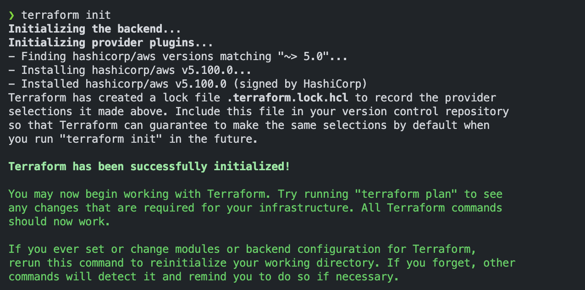

## 🥑 들어가며

> terraform을 연습한 코드는 [이 곳](https://github.com/dnya0/terraform-practice)에서 볼 수 있다.

AWS의 EC2 설정을 파일로 저장해서 관리할 수 있다면 얼마나 좋을까? 이러한 고민중 Terraform이란 플랫폼을 발견하게 되었다.

<br>

## 📌 Terraform 이란?

### 소개

HashiCorp가 만든 Infrastructure as Code(IaC) 도구로, 클라우드 인프라를 코드로 선언적으로 관리할 수 있게 해줍니다. AWS, GCP, Azure 등 대부분의 클라우드를 지원한다.

<br>

### AWS-CLI와의 차이점

AWS CLI는 명령을 하나씩 직접 실행하는 명령형 도구인 반면, Terraform은 선언하면 현재 상태와 비교해서 필요한 작업을 알아서 처리해주는 선언형 도구이다. 때문에 AWS CLI는 상태 추적이 없어 같은 명령을 두 번 실행하면 오류가 나거나 중복이 생길 수 있지만, Terraform은 상태 파일(tfstate)로 인프라를 추적하기 때문에 몇 번을 실행해도 결과가 동일하고, 리소스 간 의존성도 자동으로 처리해줍니다.

<br>

## ⚙️ Terraform 설치하기

### 1. Homebrew Install

Terraform은 HashiCorp가 공식 tap으로 관리 주체를 옮겼기 때문에, Homebrew가 아닌 `hashicorp/tap`을 통해 설치해야 한다.

```shell
# Homebrew에 hashicorp/tap라는 서드파티 저장소를 등록
$ brew tap hashicorp/tap
$ brew search terraform

# terraform 설치
$ brew install hashicorp/tap/terraform

# 버전 확인
$ terraform version
Terraform v1.14.6
on darwin_arm64
```

<br>

### 2. Terraform 버전 관리

특정 버전의 테라폼을 사용하고 싶거나, 여러 버전을 사용할 필요가 있을 때는 `tfenv`을 사용하면 된다. `tfenv`는 테라폼 버전 매니저로 맥OS, 리눅스, 윈도우를 지원하고 있다. Homebrew로 이미 설치한 경우엔 넘어가도 된다. 

만약 `hashicorp/tap/terraform`과 `tfenv`를 같이 설치한 경우 버전 충돌이 일어날 수 있다고 한다.

```shell
# tfenv 설치
$ brew install tfenv
```

```shell
$ tfenv install 1.14.6
$ tfenv use 1.14.6

$ terraform version
Terraform v1.14.6
on darwin_arm64
```

<br>

## 📚 Terraform 이해하기

### 개념

#### 프로비저닝 Provisioning

- 어떤 프로세스나 서비스를 실행하기 위한 준비 단계
- 크게 네트워크나 컴퓨팅 자원을 준비하는 작업, 준비된 컴퓨팅 자원에 사이트 패키지나 애플리케이션 의존성을 준비하는 단계로 나뉘어짐

#### 프로바이더 Provider

- 테라폼과 외부 서비스를 연결해주는 기능을 하는 모듈

#### 리소스(자원) Resource

- 특정 프로바이더가 제공해주는 조작 가능한 대상의 최소 단위

#### 상태 State

- 테라폼이 관리하는 인프라의 현재 상태를 기록한 스냅샷
- `terraform.tfstate` 파일에 저장되며, Plan과 Apply 시 실제 인프라와 비교하는 기준이 됨
- 이 파일이 없거나 실제 인프라와 어긋나면 의도치 않은 변경이 발생할 수 있어 매우 중요하게 관리해야 함

#### 백엔드 Backend

- State 파일을 저장하는 위치를 설정하는 것
- 기본값은 로컬 파일이지만, 팀 협업 시에는 S3 등 원격 저장소에 저장하는 Remote Backend를 사용함
- Remote Backend를 사용하면 여러 사람이 동시에 같은 state를 바라보고 작업할 수 있음

#### 모듈 Module

- 여러 리소스를 하나로 묶어 재사용 가능하게 만든 코드 단위
- 예를 들어 VPC + 서브넷 + 보안그룹을 묶어 하나의 네트워크 모듈로 만들면, 환경마다 반복 작성 없이 호출해서 사용할 수 있음
- Terraform Registry에 공개된 공식/커뮤니티 모듈을 가져다 쓸 수도 있음

#### 변수 Variable

- 코드에서 반복되거나 환경마다 달라지는 값을 외부에서 주입할 수 있도록 선언하는 것
- `variable` 블록으로 선언하고, `var.변수명`으로 참조함
- `.tfvars` 파일이나 환경변수로 값을 넘길 수 있어 dev/prod 환경 분리에 유용함

#### 출력 Output

- Apply 후 생성된 리소스의 특정 값을 외부로 노출하는 것
- `output` 블록으로 선언하며, 생성된 EC2의 IP나 S3 버킷 이름 등을 확인할 때 사용함
- 모듈 간에 값을 전달할 때도 Output을 활용함

#### 계획 Plan

- 테라폼 프로젝트 디렉터리 아래의 모든 .tf 파일의 내용을 실제로 적용 가능한지 확인하는 작업
- 테라폼은 이를 `terraform plan` 명령어로 제공하며, 이 명령어를 실행하면 어떤 리소스가 생성되고, 수정되고, 삭제될지 계획을 보여줌

#### 적용 Apply

- 테라폼 프로젝트 디렉터리 아래의 모든 .tf 파일의 내용대로 리소스를 생성, 수정, 삭제하는 일
- 테라폼은 이를 `terraform apply` 명령어로 제공
  - 이 명령어를 실행하기 전에 변경 예정 사항은 plan 명령어를 사용해 확인할 수 있음. 적용하기 전에도 플랜의 결과를 보여줌

#### 삭제 Destroy

- 테라폼이 관리하는 모든 리소스를 일괄 삭제하는 작업
- `terraform destroy` 명령어로 제공하며, Apply와 반대되는 개념
- 전체 삭제가 아닌 특정 리소스만 삭제할 경우 코드에서 해당 리소스를 제거한 후 Apply하는 방식을 사용함

<br>

### 기본 코드

```hcl
# provider 설정
provider "aws" {
  region = "ap-northeast-2"  # 서울 리전
}

# 변수 선언
variable "instance_type" {
  default = "t3.micro"
}

# EC2 인스턴스 생성
resource "aws_instance" "my_server" {
  ami           = "ami-12345678"
  instance_type = var.instance_type

  tags = {
    Name = "MyServer"
  }
}

# 생성된 IP 출력
output "public_ip" {
  value = aws_instance.my_server.public_ip
}
```

<br>

## Terraform 경험해보기

나는 Terraform을 경험해보는 것에 초점을 맞췄기 때문에 전에 간단한 CRUD를 만들었던 Ktor 프로젝트를 EC2에 배포해보기로 하였다. 간단하게 VPC와 서브넷, 게이트웨이를 적용해보고자 한다.

<br>

### 전체 구성 개요

```
인터넷 → ALB → EC2 (Docker로 Ktor 실행)
```

<br>

### 단계별 계획

#### 1단계 — Ktor 프로젝트 준비

- `Dockerfile` 작성 (JAR 빌드 → 실행)
- 로컬에서 Docker 빌드 & 동작 확인

#### 2단계 — ECR (Elastic Container Registry) 설정

- Terraform으로 ECR 레포지토리 생성
- 빌드한 이미지를 ECR에 push
- EC2가 ECR에서 이미지를 pull해올 수 있도록 IAM 역할 설정

#### 3단계 — 네트워크 구성 (Terraform)

- **VPC** 생성
- **퍼블릭 서브넷** 2개 이상 (ALB는 가용영역 2개 이상 필요)
- **인터넷 게이트웨이** + **라우팅 테이블** 연결
- **보안 그룹** 2개
  - ALB용: 80 포트 인바운드 허용
  - EC2용: ALB에서 오는 트래픽만 허용 (8080 포트)

#### 4단계 — EC2 구성 (Terraform)

- EC2 인스턴스 생성
- **User Data** 스크립트로 인스턴스 시작 시 자동으로
  - Docker 설치
  - ECR 로그인
  - 이미지 pull 후 컨테이너 실행

#### 5단계 — ALB 구성 (Terraform)

- **ALB** 생성 및 퍼블릭 서브넷에 배치
- **타겟 그룹** 생성 (EC2를 타겟으로 등록)
- **리스너** 설정 (80 포트 → 타겟 그룹으로 포워딩)

#### 6단계 — 확인

- `terraform apply`
- ALB DNS 주소로 Ktor 앱 접근 확인

<br>

### 파일 구조

```
terraform-practice/
├── main.tf
├── variables.tf
├── outputs.tf
├── vpc.tf
├── ec2.tf
├── alb.tf
├── ecr.tf
└── .gitignore
```

<br>

### Terraform 프로젝트 초기 세팅

Terraform은 별도의 프로젝트 생성 명령어가 없기 때문에 디렉토리를 직접 만들고 `.tf` 파일을 작성한 뒤 `terraform init`으로 초기화하는 방식이다.

`main.tf`에 AWS provider를 선언했다.

```hcl
terraform {
  required_providers {
    aws = {
      source  = "hashicorp/aws"
      version = "~> 5.0"
    }
  }
}

provider "aws" {
  region = var.aws_region
}
```

`variables.tf`에는 리전을 변수로 분리해뒀다.

```hcl
variable "aws_region" {
  default = "ap-northeast-2"
}
```

AWS 자격증명은 `aws configure`로 미리 설정해두었기 때문에 별도 작업 없이 바로 초기화를 진행했다.

```bash
terraform init
```



`No changes`가 뜨면 정상적으로 세팅이 완료된 것이다. 다음 글부터 단계별로 리소스를 하나씩 작성해보겠다.
