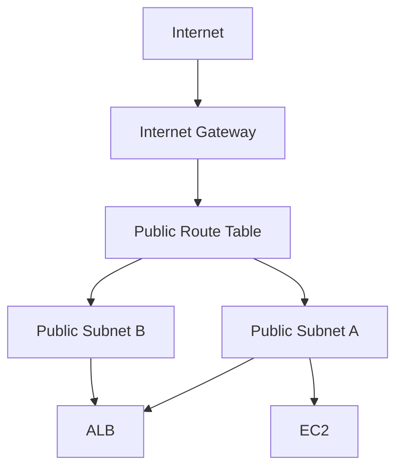

## 🥑 들어가며

이전 글에서는 Terraform이 무엇인지 알아보고, AWS provider를 설정한 뒤 `terraform init`까지 진행했다.

이번 글에서는 실제 AWS 리소스를 하나씩 만들어보려고 한다.
가장 먼저 구성할 부분은 네트워크다.

EC2에 애플리케이션을 올리고, ALB를 통해 외부에서 접근하려면 먼저 EC2와 ALB가 위치할 VPC, Subnet, Internet Gateway, Route Table이 필요하다.
이번 글에서는 이 네트워크 기반을 Terraform으로 작성해보겠다.

<br>

## 만들 구조

이번 글에서 만들 구조는 아래와 같다.



이번 글에서는 ALB와 EC2를 만들지는 않는다.
다만 다음 단계에서 ALB와 EC2를 올릴 수 있도록 네트워크만 먼저 구성한다.

구성할 리소스는 다음과 같다.

- VPC
- Public Subnet 2개
- Internet Gateway
- Public Route Table
- Route Table Association

<br>

## VPC란?

VPC는 `Virtual Private Cloud`의 약자로, AWS 안에 만드는 격리된 가상 네트워크다.

EC2, RDS, ALB 같은 리소스는 VPC 안에 배치된다.
즉, VPC는 AWS 인프라의 네트워크 경계라고 볼 수 있다.

VPC를 만들 때는 `CIDR block`을 지정해야 한다.
CIDR block은 이 VPC 안에서 사용할 IP 주소 범위를 의미한다.

예를 들어 이번 글에서는 아래 범위를 사용할 것이다.

```text
10.0.0.0/16
```

`/16`은 `10.0.0.0`부터 `10.0.255.255`까지 사용할 수 있다는 의미다.
이 범위 안에서 서브넷을 나누어 사용하게 된다.

<br>

## Subnet이란?

Subnet은 VPC 안의 IP 대역을 더 작게 나눈 네트워크다.

VPC가 큰 네트워크라면, Subnet은 그 안에 있는 작은 네트워크 단위라고 볼 수 있다.
AWS에서는 Subnet이 특정 Availability Zone에 속한다.

이번 글에서는 ALB 구성을 고려해 Public Subnet을 2개 만들 것이다.
ALB는 최소 2개 이상의 Availability Zone에 걸쳐 배치하는 것이 일반적이기 때문이다.

```text
VPC: 10.0.0.0/16

Public Subnet A: 10.0.1.0/24
Public Subnet B: 10.0.2.0/24
```

<br>

## vpc.tf 작성하기

이전 글에서 만들었던 파일 구조 중 `vpc.tf`에 네트워크 리소스를 작성한다.

```text
terraform-practice/
├── main.tf
├── variables.tf
├── outputs.tf
├── vpc.tf
├── ec2.tf
├── alb.tf
├── ecr.tf
└── .gitignore
```

<br>

### VPC 생성

먼저 VPC를 생성한다.

```hcl
resource "aws_vpc" "main" {
  cidr_block           = "10.0.0.0/16"
  enable_dns_support   = true
  enable_dns_hostnames = true

  tags = {
    Name = "terraform-practice-vpc"
  }
}
```

`enable_dns_support`와 `enable_dns_hostnames`는 VPC 안에서 DNS 기능을 사용할 수 있도록 설정하는 옵션이다.
EC2나 ALB를 사용할 때 DNS 이름을 활용하는 경우가 많기 때문에 함께 켜두었다.

<br>

### Public Subnet 생성

다음으로 Public Subnet을 2개 생성한다.

```hcl
resource "aws_subnet" "public_a" {
  vpc_id                  = aws_vpc.main.id
  cidr_block              = "10.0.1.0/24"
  availability_zone       = "ap-northeast-2a"
  map_public_ip_on_launch = true

  tags = {
    Name = "terraform-practice-public-a"
  }
}

resource "aws_subnet" "public_b" {
  vpc_id                  = aws_vpc.main.id
  cidr_block              = "10.0.2.0/24"
  availability_zone       = "ap-northeast-2c"
  map_public_ip_on_launch = true

  tags = {
    Name = "terraform-practice-public-b"
  }
}
```

`vpc_id = aws_vpc.main.id`는 앞에서 만든 VPC의 ID를 참조한다는 의미다.
Terraform은 이렇게 리소스 간 참조를 사용하면 의존성을 자동으로 파악한다.

즉, Subnet은 VPC가 만들어진 뒤에 생성된다.
따로 생성 순서를 명령하지 않아도 Terraform이 알아서 순서를 계산해준다.

`map_public_ip_on_launch`를 `true`로 설정하면 이 서브넷에서 생성되는 EC2에 Public IP가 자동으로 할당된다.
Public Subnet으로 사용할 것이기 때문에 해당 옵션을 켜두었다.

<br>

## Internet Gateway 생성하기

Public Subnet이 외부 인터넷과 통신하려면 Internet Gateway가 필요하다.

Internet Gateway는 VPC와 인터넷을 연결하는 출입구 역할을 한다.
단, Internet Gateway만 만든다고 바로 인터넷 통신이 되는 것은 아니다.
Route Table에서 인터넷으로 나가는 경로도 함께 설정해야 한다.

```hcl
resource "aws_internet_gateway" "main" {
  vpc_id = aws_vpc.main.id

  tags = {
    Name = "terraform-practice-igw"
  }
}
```

여기서도 `vpc_id`에 `aws_vpc.main.id`를 넣어 앞에서 생성한 VPC에 Internet Gateway를 연결했다.

<br>

## Route Table 생성하기

Route Table은 네트워크 트래픽이 어디로 나가야 하는지 정하는 규칙이다.

Public Subnet이 인터넷과 통신하려면 아래 라우팅이 필요하다.

```text
0.0.0.0/0 -> Internet Gateway
```

`0.0.0.0/0`은 모든 IPv4 주소를 의미한다.
즉, VPC 내부 대역이 아닌 외부로 나가는 트래픽은 Internet Gateway로 보내겠다는 뜻이다.

```hcl
resource "aws_route_table" "public" {
  vpc_id = aws_vpc.main.id

  route {
    cidr_block = "0.0.0.0/0"
    gateway_id = aws_internet_gateway.main.id
  }

  tags = {
    Name = "terraform-practice-public-rt"
  }
}
```

<br>

## Route Table Association 설정하기

Route Table을 만들었다고 해서 Subnet에 자동으로 적용되지는 않는다.
Subnet이 어떤 Route Table을 사용할지 연결해줘야 한다.

이를 `Route Table Association`이라고 한다.

```hcl
resource "aws_route_table_association" "public_a" {
  subnet_id      = aws_subnet.public_a.id
  route_table_id = aws_route_table.public.id
}

resource "aws_route_table_association" "public_b" {
  subnet_id      = aws_subnet.public_b.id
  route_table_id = aws_route_table.public.id
}
```

이렇게 설정하면 `public_a`, `public_b` 서브넷은 모두 Public Route Table을 사용하게 된다.

결과적으로 두 서브넷에서 외부 인터넷으로 나가는 트래픽은 Internet Gateway를 통해 나갈 수 있다.

<br>

## vpc.tf 전체 코드

지금까지 작성한 `vpc.tf` 전체 코드는 아래와 같다.

```hcl
resource "aws_vpc" "main" {
  cidr_block           = "10.0.0.0/16"
  enable_dns_support   = true
  enable_dns_hostnames = true

  tags = {
    Name = "terraform-practice-vpc"
  }
}

resource "aws_subnet" "public_a" {
  vpc_id                  = aws_vpc.main.id
  cidr_block              = "10.0.1.0/24"
  availability_zone       = "ap-northeast-2a"
  map_public_ip_on_launch = true

  tags = {
    Name = "terraform-practice-public-a"
  }
}

resource "aws_subnet" "public_b" {
  vpc_id                  = aws_vpc.main.id
  cidr_block              = "10.0.2.0/24"
  availability_zone       = "ap-northeast-2c"
  map_public_ip_on_launch = true

  tags = {
    Name = "terraform-practice-public-b"
  }
}

resource "aws_internet_gateway" "main" {
  vpc_id = aws_vpc.main.id

  tags = {
    Name = "terraform-practice-igw"
  }
}

resource "aws_route_table" "public" {
  vpc_id = aws_vpc.main.id

  route {
    cidr_block = "0.0.0.0/0"
    gateway_id = aws_internet_gateway.main.id
  }

  tags = {
    Name = "terraform-practice-public-rt"
  }
}

resource "aws_route_table_association" "public_a" {
  subnet_id      = aws_subnet.public_a.id
  route_table_id = aws_route_table.public.id
}

resource "aws_route_table_association" "public_b" {
  subnet_id      = aws_subnet.public_b.id
  route_table_id = aws_route_table.public.id
}
```

<br>

## terraform plan 실행하기

코드를 작성했다면 바로 `apply`하기 전에 `plan`으로 어떤 리소스가 생성될지 확인한다.

```bash
terraform plan
```

`plan` 결과를 보면 VPC, Subnet, Internet Gateway, Route Table, Route Table Association이 생성될 예정이라고 나온다.

Terraform에서 `+` 표시는 새로 생성될 리소스를 의미한다.

```text
Plan: 7 to add, 0 to change, 0 to destroy.
```

이번 글에서 생성하는 리소스는 총 7개다.

- VPC 1개
- Public Subnet 2개
- Internet Gateway 1개
- Route Table 1개
- Route Table Association 2개

<br>

## terraform apply 실행하기

`plan` 결과에 문제가 없다면 `apply`를 실행한다.

```bash
terraform apply
```

실행하면 Terraform이 다시 한 번 변경 내용을 보여주고, 실제로 적용할지 물어본다.

```text
Do you want to perform these actions?
  Terraform will perform the actions described above.
  Only 'yes' will be accepted to approve.

  Enter a value:
```

`yes`를 입력하면 리소스 생성이 시작된다.

```text
Apply complete! Resources: 7 added, 0 changed, 0 destroyed.
```

이렇게 나오면 네트워크 리소스 생성이 완료된 것이다.

<br>

## AWS 콘솔에서 확인하기

Terraform으로 생성한 리소스는 AWS 콘솔에서도 확인할 수 있다.

VPC 콘솔에 들어가면 `terraform-practice-vpc`라는 이름의 VPC가 생성되어 있다.

Public Subnet도 `terraform-practice-public-a`, `terraform-practice-public-b`라는 이름으로 생성된 것을 확인할 수 있다.

Route Table을 보면 `0.0.0.0/0` 대상이 Internet Gateway로 설정되어 있고, 두 Public Subnet이 연결되어 있다.

<br>

## Terraform 참조 방식

이번 글에서 가장 중요하게 볼 부분은 리소스 간 참조다.

```hcl
vpc_id = aws_vpc.main.id
```

Terraform에서는 리소스를 아래 형식으로 참조한다.

```text
리소스타입.리소스이름.속성
```

예를 들어 `aws_vpc.main.id`는 `aws_vpc` 타입의 `main`이라는 리소스에서 `id` 값을 가져온다는 뜻이다.

이런 참조를 사용하면 Terraform은 리소스 간 의존성을 자동으로 알 수 있다.
그래서 VPC를 먼저 만들고, 그 뒤에 Subnet과 Internet Gateway를 만드는 순서로 실행된다.

Terraform을 사용할 때 직접 생성 순서를 관리하지 않아도 되는 이유가 여기에 있다.

<br>

## 정리

이번 글에서는 Terraform으로 AWS 네트워크 기반을 구성했다.

만든 리소스는 다음과 같다.

- VPC
- Public Subnet 2개
- Internet Gateway
- Public Route Table
- Route Table Association

이번 단계까지 완료하면 EC2와 ALB를 올릴 수 있는 기본 네트워크가 준비된다.

다음 글에서는 EC2와 ALB 앞단에서 사용할 Security Group을 만들고, Docker 이미지를 저장할 ECR을 Terraform으로 구성해보겠다.
