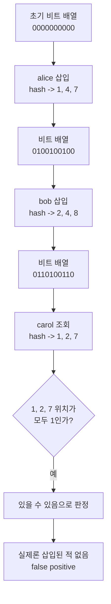

## 🥑 들어가며

회원가입 화면에서 사용자 이름을 입력하면, 서비스는 거의 즉시 "이미 사용 중입니다" 혹은 "사용 가능한 이름입니다" 같은 피드백을 보여준다. 그런데 사용자 수가 매우 많은 서비스라면, 입력할 때마다 매번 데이터베이스를 직접 조회하는 방식은 부담이 커질 수 있다.

이럴 때 떠올릴 수 있는 대표적인 자료구조가 바로 **Bloom Filter**이다. 실제 Gmail의 내부 구현이 공개되어 있는 것은 아니지만, 대규모 서비스에서 "어떤 값이 이미 존재할 가능성이 높은지"를 아주 빠르게 검사해야 할 때 Bloom Filter 같은 확률적 자료구조를 사용하는 것은 매우 자연스러운 선택이다.

<br>

## 📌 Bloom Filter 블룸 필터

Bloom Filter는 **집합에 어떤 원소가 들어있는지 빠르게 검사하기 위한 확률적 자료구조**이다. 핵심은 "정확한 최종 판정"이 아니라, **아주 적은 메모리로 빠른 1차 필터링**을 제공한다는 점이다.

보통 다음과 같은 상황에서 유용하다.

- 디스크 I/O나 네트워크 호출을 줄이고 싶을 때
- "없음"을 빠르게 판정해서 비싼 작업을 건너뛰고 싶을 때
- 약간의 오탐(false positive)을 허용할 수 있을 때

<br>

### 동작 원리

Bloom Filter는 크게 두 가지로 구성된다.

- 여러 개의 해시 함수
- 0과 1로 이루어진 비트 배열

처음에는 비트 배열의 모든 값이 `0`이다. 아직 어떤 원소도 들어오지 않았기 때문이다.

예를 들어 `alice`라는 사용자 이름을 Bloom Filter에 넣는다고 해보자. `alice`를 여러 해시 함수에 통과시키면 서로 다른 위치 몇 개가 나온다. 예를 들어 `3`, `10`, `21`이라는 위치가 계산되었다면, 비트 배열의 `3`, `10`, `21`번째 값을 모두 `1`로 바꾼다.

이후 `bob`이라는 값을 넣었는데 `10`, `18`, `25`가 나왔다고 해보자. 그러면 `10`, `18`, `25`를 다시 `1`로 바꾼다. 여기서 중요한 점은, Bloom Filter는 `alice`나 `bob`이라는 문자열 자체를 저장하지 않는다는 것이다. 단지 여러 해시 함수가 만들어낸 위치에 흔적만 남긴다.

간단하게 그리면 이런 느낌이다.


이제 어떤 사용자가 `alice`가 사용 가능한지 확인하려고 하면, 동일하게 여러 해시 함수를 적용해서 같은 위치들을 확인한다.

- 확인한 비트 중 하나라도 `0`이면: 그 값은 **집합에 절대 존재하지 않는다**
- 확인한 비트가 모두 `1`이면: 그 값은 **존재할 가능성이 높다**

조회 과정도 그림으로 보면 더 직관적이다.


왜 이런 판정이 가능할까? `alice`가 실제로 한 번도 들어간 적이 없다면, `alice`가 가리키는 비트들 중 적어도 하나는 아직 `0`일 가능성이 높다. 그러면 Bloom Filter는 곧바로 "이 값은 없다"고 판단할 수 있다.

반대로 `alice`가 가리키는 비트가 모두 `1`이라고 해서, 반드시 `alice`가 들어 있었다는 뜻은 아니다. 다른 여러 값들이 우연히 같은 위치들을 채워놓았을 수도 있다. 바로 이 경우가 **false positive**이다.

숫자로 더 작게 보면 이해가 쉽다. 비트 배열 길이가 `m = 10`이고, 해시 함수는 3개라고 가정해보자.

처음 상태는 아래와 같다.

```text
인덱스: 0 1 2 3 4 5 6 7 8 9
비트값: 0 0 0 0 0 0 0 0 0 0
```

여기에 `alice`를 넣었더니 해시 결과가 `1`, `4`, `7`이 나왔다고 하자.

```text
인덱스: 0 1 2 3 4 5 6 7 8 9
비트값: 0 1 0 0 1 0 0 1 0 0
```

이제 `bob`을 넣었더니 `2`, `4`, `8`이 나왔다고 해보자.

```text
인덱스: 0 1 2 3 4 5 6 7 8 9
비트값: 0 1 1 0 1 0 0 1 1 0
```

이 상태에서 `carol`을 조회했는데 해시 결과가 `1`, `2`, `7`이라고 하자. 그러면 해당 위치는 모두 `1`이다. Bloom Filter는 이 값을 보고 "있을 수 있다"고 판단한다.

하지만 실제로 `carol`은 넣은 적이 없다. `alice`와 `bob`이 남긴 흔적이 우연히 겹쳐서, `carol`이 들어 있었던 것처럼 보인 것이다. 이게 바로 false positive의 전형적인 예시다.

그림으로 보면 더 직관적이다.



여기서 중요한 특징이 나온다.

- **False Negative는 없다**: Bloom Filter가 "없다"고 말하면, 정말 없는 것이다.
- **False Positive는 있다**: 실제로는 없는데도 "있을 수 있다"고 판단할 수 있다.

즉, Bloom Filter는 "정확히 존재한다"를 보장하는 자료구조가 아니라, **"없음"을 매우 빠르게 판정하는 자료구조**라고 보는 편이 더 정확하다.

조금 다르게 말하면, Bloom Filter는 **정답을 저장하는 자료구조**가 아니라 **가능성을 압축해서 저장하는 자료구조**에 가깝다. 그래서 메모리를 매우 적게 쓰는 대신, 가끔은 "있을지도 모른다"는 오탐을 감수한다.

<br>

### 메모리를 적게 쓰는 이유

일반적인 Hash Set은 원소 자체를 저장해야 한다. 문자열이라면 문자열 데이터, 해시 테이블 오버헤드, 포인터 등도 함께 관리해야 한다. 원소 수가 수천만, 수억 개로 커질수록 메모리 사용량도 빠르게 증가한다.

반면 Bloom Filter는 원소 원본을 저장하지 않고, 비트 배열만 유지한다. 즉, 아주 많은 데이터를 직접 들고 있지 않아도 "없음" 여부를 빠르게 확인할 수 있다. 이 점 때문에 대규모 시스템에서 캐시 앞단이나 데이터베이스 앞단의 1차 필터로 자주 언급된다.

<br>

### 해시 함수 개수와 비트 배열 크기

Bloom Filter의 성능은 대체로 다음 세 가지에 의해 결정된다.

- 비트 배열의 크기
- 저장할 원소 수
- 해시 함수의 개수

보통 아래와 같이 기호를 둔다.

- `m`: 비트 배열의 전체 길이
- `n`: Bloom Filter에 넣은 원소의 개수
- `k`: 사용하는 해시 함수의 개수

비트 배열이 너무 작으면 많은 원소가 같은 공간을 공유하게 되고, 점점 더 많은 비트가 `1`로 채워진다. 그러면 실제로는 없는 값도 "있을 수 있음"으로 판정될 가능성이 커진다.

해시 함수도 무조건 많다고 좋은 것은 아니다. 너무 적으면 흔적이 충분히 퍼지지 않고, 너무 많으면 한 원소를 넣을 때 너무 많은 비트를 `1`로 만들어 비트 배열이 빨리 포화된다.

그래서 실무에서는 보통 "예상 원소 수"와 "허용 가능한 false positive rate"를 먼저 정한 다음, 그에 맞춰 비트 배열 크기와 해시 함수 개수를 계산해 사용한다.

<br>

### 오탐률은 왜 커질까?

Bloom Filter에 원소를 하나 넣을 때마다 `k`개의 위치를 `1`로 만들려고 시도한다. 원소가 계속 늘어나면 비트 배열 안의 `1`의 비율도 점점 높아진다. 그러면 조회할 때 우연히 모든 비트가 `1`인 경우가 많아지고, 실제로는 없는 값도 "있을 수 있다"고 판단할 확률이 올라간다.

이를 아주 단순하게 쓰면, 원소를 `n`개 넣은 뒤 어떤 한 비트가 아직도 `0`일 확률은 대략 다음과 같다.

$$
\left(1 - \frac{1}{m}\right)^{kn}
$$

`m`개의 비트 중 하나가 선택되지 않을 확률이 `1 - \frac{1}{m}`이고, 이런 선택이 대략 `kn`번 반복된다고 보는 것이다.

`m`이 충분히 크면 이를 다음처럼 자주 근사한다.

$$
\left(1 - \frac{1}{m}\right)^{kn} \approx e^{-kn/m}
$$

그러면 어떤 한 비트가 `1`일 확률은 대략

$$
1 - e^{-kn/m}
$$

가 된다.

이제 조회할 때는 해시 함수 `k`개가 가리키는 모든 비트가 `1`이어야 "있을 수 있음"이라고 판단한다. 따라서 false positive rate는 보통 다음처럼 근사한다.

$$
\left(1 - e^{-kn/m}\right)^k
$$

이 식에서 중요한 직관은 간단하다.

- `n`이 커질수록: 더 많은 원소가 들어오므로 오탐률이 커진다.
- `m`이 커질수록: 비트 배열이 넓어지므로 오탐률이 줄어든다.
- `k`는 너무 작아도, 너무 커도 비효율적일 수 있다.

이때 false positive rate를 가장 낮추는 해시 함수 개수는 보통 아래처럼 알려져 있다.

$$
k = \frac{m}{n}\ln 2
$$

즉, 비트 배열 크기 `m`에 비해 저장할 원소 수 `n`이 많아질수록 적절한 해시 함수 개수도 달라진다. 직관적으로 보면, 해시 함수가 너무 적으면 비트 배열에 흔적이 충분히 퍼지지 않고, 너무 많으면 비트가 너무 빨리 `1`로 차서 오히려 오탐률이 커진다. 위 식은 그 사이에서 균형이 가장 좋은 지점을 나타낸다.

즉, 원소 수가 계속 증가하는데 비트 배열 크기 `m`을 그대로 두면, 배열이 점점 더 `1`로 가득 차고 false positive rate도 함께 증가한다. Bloom Filter를 운영할 때 예상 원소 수를 미리 잡는 이유가 바로 여기에 있다.

<br>

## 📮 사용자 이름 중복 확인에 적용하면

대규모 서비스의 가입 과정을 단순화해서 생각해보면 보통 다음과 같이 동작할 수 있다.

1. 사용자가 사용자 이름을 입력한다.
2. 애플리케이션은 Bloom Filter를 먼저 조회한다.
3. Bloom Filter가 "없다"고 판단하면, 우선 사용 가능성이 높다고 빠르게 응답한다.
4. Bloom Filter가 "있을 수 있다"고 판단하면, 실제 데이터베이스를 조회해 최종 확인한다.

이 방식의 장점은 대부분의 요청을 아주 싸게 처리할 수 있다는 점이다. 특히 존재하지 않는 사용자 이름을 확인하는 요청이 많다면, 데이터베이스까지 가지 않고도 상당수를 초기에 걸러낼 수 있다.

아래처럼 흐름을 그려볼 수 있다.


<br>

## ⚠️ 그런데 이것만으로 충분할까?

아니다. Bloom Filter는 어디까지나 **사전 검사**일 뿐이고, 최종 진실은 데이터베이스가 가지고 있어야 한다.

이유는 두 가지다.

첫째, Bloom Filter에는 false positive가 있다. 즉, 실제로는 비어 있는 사용자 이름인데도 "이미 있을 수 있음"으로 나올 수 있다. 따라서 중요한 결정은 결국 실제 저장소에서 다시 확인해야 한다.

둘째, 동시성 문제가 있다. 예를 들어 두 사용자가 거의 동시에 같은 사용자 이름을 제출할 수 있다. 이 경우 Bloom Filter는 둘 다 "가능할 수 있음" 혹은 "없음"이라고 볼 수도 있지만, **최종 승자는 데이터베이스의 UNIQUE 제약 조건**이 결정한다.

즉, 실제 시스템에서는 보통 다음과 같이 처리한다.

1. UI 단계에서는 Bloom Filter로 빠른 피드백을 준다.
2. 가입 요청을 제출하면 서버가 실제 데이터베이스에 저장을 시도한다.
3. 이때 UNIQUE 제약 조건에 먼저 성공한 요청만 해당 이름을 차지한다.
4. 나중에 들어온 요청은 "이미 사용 중" 오류를 받는다.

정리하면, **Bloom Filter는 빠른 힌트를 주는 도구이고, 최종 판정기는 데이터베이스**이다.

동시성까지 포함하면 최종 저장 단계는 아래와 같이 이해할 수 있다.


<br>

## ✅ 마무리

대규모 서비스에서 모든 중복 확인 요청을 곧바로 데이터베이스로 보내면 비용이 크다. Bloom Filter는 이 문제를 완화하기 위해, 적은 메모리로 "이 값이 없다는 사실"을 매우 빠르게 알려주는 자료구조다.

사용자 이름 중복 확인 같은 기능에 적용하면 응답 속도를 높이고 저장소 부하를 줄일 수 있다. 다만 false positive와 동시성 문제 때문에, 실제 운영 환경에서는 반드시 데이터베이스의 고유성 제약과 함께 사용해야 한다.

결국 Bloom Filter는 "정답을 내리는 자료구조"라기보다, **비싼 확인 작업을 줄여주는 똑똑한 예비 검사기**에 가깝다.
