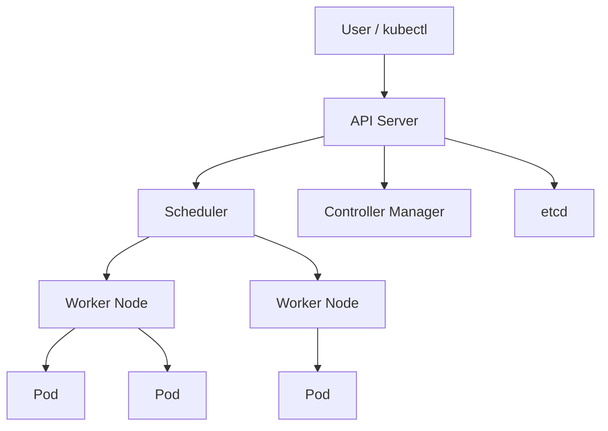

## 🥑 들어가며

컨테이너 기반 애플리케이션을 운영하다 보면 단순히 컨테이너를 실행하는 것만으로는 부족하다.
서비스가 죽었을 때 다시 띄워야 하고, 트래픽이 늘어나면 인스턴스를 늘려야 하며, 배포 중에도 사용자가 서비스를 계속 사용할 수 있어야 한다.

Kubernetes는 이런 컨테이너 운영 문제를 해결하기 위한 컨테이너 오케스트레이션 도구다.
이번 글에서는 Kubernetes가 왜 필요한지, 어떤 구조로 동작하는지, 기본 구성 요소는 무엇인지 정리해보려 한다.
그리고 MSA 환경에서 Kubernetes의 Service Discovery, Circuit Breaker, Sidecar, Service Mesh가 어떻게 이어지는지도 함께 정리해보려 한다.

이전에 컨테이너 오케스트레이션이 필요했을 때는 Kubernetes 대신 Docker Swarm을 사용했었다.
당시에는 Kubernetes가 너무 무겁게 느껴졌고, 작은 규모의 서비스에서는 Swarm이 훨씬 단순하게 시작할 수 있었기 때문이다.
이번에는 Docker Swarm과 비교하면서 Kubernetes가 어떤 문제를 더 넓은 범위에서 해결하려는지도 함께 살펴보려 한다.

<br>

## Kubernetes란?

Kubernetes는 컨테이너화된 애플리케이션을 배포, 확장, 관리하기 위한 오픈소스 플랫폼이다.

Docker 같은 컨테이너 런타임이 컨테이너 하나를 실행하는 데 초점이 있다면, Kubernetes는 여러 서버 위에서 수많은 컨테이너를 안정적으로 운영하는 데 초점이 있다.

Kubernetes는 보통 `k8s`라고 줄여 부른다.
`Kubernetes`에서 `K`와 `s` 사이에 8개의 글자가 있기 때문이다.


<br>

## Kubernetes가 필요한 이유

컨테이너를 직접 운영한다고 생각해보자.

- 컨테이너가 죽으면 누가 다시 실행할까?
- 서버 한 대에 트래픽이 몰리면 어떻게 분산할까?
- 새로운 버전을 배포할 때 기존 요청은 어떻게 처리할까?
- 특정 서버가 장애 나면 그 안의 컨테이너는 어떻게 복구할까?
- 컨테이너가 많아졌을 때 설정과 네트워크는 어떻게 관리할까?

Kubernetes는 이런 운영 작업을 자동화한다.
사용자는 원하는 상태를 선언하고, Kubernetes는 실제 상태가 그 선언과 같아지도록 계속 조정한다.

<br>

## 핵심 개념: Desired State

Kubernetes의 중요한 특징은 `Desired State` 기반으로 동작한다는 점이다.

예를 들어 "nginx 컨테이너를 3개 실행하고 싶다"고 선언하면 Kubernetes는 현재 상태를 확인한다.
실제로 2개만 떠 있다면 1개를 더 띄우고, 4개가 떠 있다면 1개를 줄인다.

즉, Kubernetes는 명령을 한 번 실행하고 끝나는 방식이 아니라, 원하는 상태와 현재 상태를 계속 비교하며 맞춰가는 방식으로 동작한다.

<br>

## Kubernetes 구조

Kubernetes 클러스터는 크게 `Control Plane`과 `Worker Node`로 나뉜다.



<br>

### Control Plane

Control Plane은 클러스터 전체를 관리하는 영역이다.

| Component | Description |
| :--- | :--- |
| API Server | Kubernetes 클러스터와 통신하는 진입점 |
| etcd | 클러스터 상태를 저장하는 key-value 저장소 |
| Scheduler | Pod를 어떤 Node에 배치할지 결정 |
| Controller Manager | 원하는 상태와 현재 상태를 비교하고 조정 |

<br>

### Worker Node

Worker Node는 실제 애플리케이션 컨테이너가 실행되는 서버다.

| Component | Description |
| :--- | :--- |
| kubelet | Node에서 Pod 상태를 관리하는 에이전트 |
| kube-proxy | Kubernetes 네트워크 규칙을 관리 |
| Container Runtime | 컨테이너를 실제로 실행하는 런타임 |

<br>

## 주요 리소스

Kubernetes에서는 애플리케이션을 여러 리소스로 표현한다.

| Resource | Description |
| :--- | :--- |
| Pod | Kubernetes에서 실행되는 가장 작은 배포 단위 |
| ReplicaSet | 지정한 개수만큼 Pod가 유지되도록 관리하는 리소스 |
| Deployment | Pod 배포, 업데이트, 롤백을 관리하는 리소스 |
| Service | Pod에 접근하기 위한 고정된 네트워크 진입점 |
| Ingress | 클러스터 외부 HTTP/HTTPS 요청을 내부 Service로 라우팅 |
| ConfigMap | 애플리케이션 설정값을 저장하는 리소스 |
| Secret | 비밀번호, 토큰 같은 민감한 값을 저장하는 리소스 |
| Volume | Pod가 사용할 저장소를 연결하는 리소스 |
| Namespace | 클러스터 안의 리소스를 논리적으로 분리하는 단위 |

<br>

### Pod

Pod는 Kubernetes에서 배포할 수 있는 가장 작은 실행 단위다.
하나 이상의 컨테이너를 포함할 수 있지만, 일반적으로 하나의 Pod에는 하나의 애플리케이션 컨테이너를 둔다.

Pod 안의 컨테이너들은 같은 네트워크 namespace와 volume을 공유한다.
그래서 같은 Pod 안에서는 `localhost`로 서로 통신할 수 있고, 같은 파일 시스템 일부를 공유할 수도 있다.

```yaml
apiVersion: v1
kind: Pod
metadata:
  name: nginx-pod
spec:
  containers:
    - name: nginx
      image: nginx:latest
```

<br>

### Sidecar Container

Pod는 하나 이상의 컨테이너를 가질 수 있다.
이때 메인 애플리케이션 컨테이너 옆에서 보조 역할을 하는 컨테이너를 Sidecar Container라고 부른다.

예를 들어 애플리케이션 컨테이너가 비즈니스 로직을 처리하고, sidecar 컨테이너가 로그 수집, 프록시, 인증, 설정 동기화 같은 일을 맡을 수 있다.
두 컨테이너는 같은 Pod 안에 있기 때문에 네트워크와 volume을 공유하면서 서로 가깝게 협력할 수 있다.

```yaml
apiVersion: v1
kind: Pod
metadata:
  name: app-with-sidecar
spec:
  containers:
    - name: app
      image: my-app:latest
    - name: log-sidecar
      image: fluent-bit:latest
```

Sidecar 패턴은 애플리케이션 코드에 직접 넣기 애매한 공통 기능을 컨테이너 단위로 분리할 때 유용하다.
Service Mesh에서 프록시 컨테이너를 붙이는 방식도 대표적인 sidecar 활용 예시다.

<br>

### Deployment

Deployment는 Pod를 선언한 개수만큼 유지하고, 배포와 롤백을 관리하는 리소스다.

Pod를 직접 생성할 수도 있지만 실제 운영에서는 보통 Deployment를 통해 Pod를 관리한다.

<br>

### ReplicaSet

ReplicaSet은 특정 Pod가 원하는 개수만큼 실행되도록 보장한다.
예를 들어 replica를 3으로 설정했는데 Pod 하나가 죽으면 ReplicaSet이 새 Pod를 만들어 다시 3개를 맞춘다.

일반적으로 ReplicaSet을 직접 다루기보다는 Deployment가 내부적으로 ReplicaSet을 생성하고 관리한다.

<br>

### Service

Pod는 언제든 새로 생성되거나 사라질 수 있기 때문에 IP가 고정적이지 않다.
Service는 이런 Pod들에 안정적인 접근 경로를 제공한다.

예를 들어 Deployment가 관리하는 Pod가 교체되더라도 Service 이름은 유지된다.
클라이언트는 매번 바뀌는 Pod IP를 알 필요 없이 Service를 통해 접근하면 된다.

Service에는 대표적으로 `ClusterIP`, `NodePort`, `LoadBalancer` 타입이 있다.

| Type | Description |
| :--- | :--- |
| ClusterIP | 클러스터 내부에서만 접근 가능한 기본 Service 타입 |
| NodePort | 각 Node의 특정 port를 통해 외부에서 접근 |
| LoadBalancer | 클라우드 로드밸런서를 통해 외부 트래픽을 Service로 전달 |

<br>

### Ingress

Ingress는 클러스터 외부의 HTTP/HTTPS 요청을 내부 Service로 연결하는 리소스다.

Service가 Pod 앞단의 고정 진입점이라면, Ingress는 여러 Service 앞에서 도메인이나 경로 기반 라우팅을 담당한다.

예를 들어 아래처럼 요청을 나눌 수 있다.

| Request | Service |
| :--- | :--- |
| `api.example.com/users` | user-service |
| `api.example.com/orders` | order-service |

Ingress 자체는 규칙이고, 실제 트래픽 처리는 Nginx Ingress Controller 같은 Ingress Controller가 담당한다.

<br>

### Network

Kubernetes 네트워크는 기본적으로 다음 원칙을 가진다.

- Pod는 고유한 IP를 가진다.
- Pod끼리는 NAT 없이 서로 통신할 수 있어야 한다.
- Node가 달라도 Pod끼리 통신할 수 있어야 한다.
- Service는 여러 Pod 앞에 고정된 접근 지점을 제공한다.

Pod는 생성되고 삭제될 때마다 IP가 바뀔 수 있다.
그래서 운영에서는 Pod IP에 직접 의존하기보다 Service, Ingress 같은 리소스를 통해 접근한다.

<br>

### Volume

Pod 안의 컨테이너 파일 시스템은 기본적으로 일시적이다.
컨테이너가 재시작되거나 Pod가 새로 만들어지면 내부 데이터가 사라질 수 있다.

Volume은 Pod에 저장소를 연결해서 데이터를 보존하거나 컨테이너 간 파일을 공유할 때 사용한다.

예를 들어 메인 컨테이너가 로그 파일을 Volume에 쓰고, sidecar 컨테이너가 같은 Volume을 읽어서 로그를 수집할 수 있다.

<br>

### Namespace

Namespace는 하나의 클러스터 안에서 리소스를 논리적으로 나누는 단위다.

예를 들어 `dev`, `staging`, `prod`처럼 환경별로 Namespace를 분리할 수 있다.
같은 이름의 리소스라도 Namespace가 다르면 서로 다른 리소스로 취급된다.

<br>

### ConfigMap과 Secret

ConfigMap은 애플리케이션 설정값을 관리할 때 사용한다.
Secret은 비밀번호, 토큰, 인증서처럼 민감한 값을 관리할 때 사용한다.

애플리케이션 이미지는 그대로 두고 환경별 설정만 바꾸고 싶을 때 ConfigMap과 Secret을 사용한다.
컨테이너 이미지를 다시 빌드하지 않아도 설정을 주입할 수 있다는 점이 중요하다.

<br>

## Kubernetes 동작 흐름

사용자가 `kubectl`로 리소스를 생성하면 대략 다음 흐름으로 동작한다.

1. 사용자가 YAML 파일을 작성한다.
2. `kubectl apply` 명령으로 API Server에 요청한다.
3. API Server는 요청을 검증하고 etcd에 상태를 저장한다.
4. Scheduler는 Pod를 실행할 Node를 선택한다.
5. 선택된 Node의 kubelet이 컨테이너 런타임에 Pod 생성을 요청한다.
6. Controller는 원하는 상태와 현재 상태를 계속 비교한다.

<br>

## Pod 설계 원칙

Kubernetes에서 가장 기본적인 설계 원칙은 애플리케이션 단위를 Pod로 잘 나누는 것이다.

일반적으로는 `1 Pod = 1 WAS`로 생각하는 것이 좋다.
예를 들어 Spring Boot 애플리케이션 하나를 하나의 Pod로 배포하고, 같은 애플리케이션을 여러 개 띄우고 싶다면 Deployment의 replica 수를 늘린다.

```text
Deployment
 ├── Pod - Spring Boot App
 ├── Pod - Spring Boot App
 └── Pod - Spring Boot App
```

<br>

### 여러 WAS를 한 Pod에 넣지 않는 이유

하나의 Pod에 여러 WAS를 넣으면 처음에는 단순해 보일 수 있다.
하지만 운영 관점에서는 문제가 많아진다.

첫 번째로 같이 죽는다.
Pod는 하나의 배포 단위이기 때문에 Pod에 문제가 생기면 안에 있는 컨테이너들이 함께 영향을 받는다.

두 번째로 서비스별 스케일링이 어려워진다.
user-service는 3개, order-service는 1개만 필요하더라도 같은 Pod 안에 있으면 독립적으로 확장하기 어렵다.

세 번째로 MSA 구조가 흐려진다.
서비스를 분리한 이유는 배포, 확장, 장애 격리를 독립적으로 하기 위함인데 여러 WAS를 한 Pod에 넣으면 다시 모놀리식에 가까워진다.

따라서 같은 생명주기를 공유해야 하는 보조 컨테이너가 아니라면, 서로 다른 애플리케이션은 별도의 Pod로 분리하는 것이 좋다.

<br>

## Kubernetes와 Service Discovery

MSA에서는 서비스가 서로를 찾아 호출할 수 있어야 한다.
과거에는 Netflix Eureka나 Consul 같은 Service Registry를 별도로 두는 경우가 많았다.

Service Registry의 역할은 단순하게 말하면 서비스의 위치를 저장하고 찾아주는 것이다.

```text
service name -> IP / port
```

하지만 Kubernetes에서는 Service와 DNS가 이 역할을 기본으로 제공한다.

```text
auth-service
   ↓
Cluster DNS
   ↓
Service
   ↓
Pod들
```

Pod IP는 계속 바뀔 수 있지만 Service 이름은 유지된다.
따라서 같은 클러스터 안에서는 `auth-service`, `user-service` 같은 이름으로 서비스를 찾을 수 있다.

Spring Cloud OpenFeign을 사용한다면 Eureka 없이도 Kubernetes Service 이름을 대상으로 호출하는 구조를 만들 수 있다.
즉, Kubernetes 환경에서는 Service 자체가 서비스 디스커버리의 핵심 역할을 한다.

<br>

## Circuit Breaker

MSA에서는 한 서비스의 장애가 다른 서비스로 전파될 수 있다.
예를 들어 user-service가 auth-service를 호출하는데 auth-service가 장애 상태라고 해보자.

```text
user-service -> auth-service
```

이때 user-service가 계속 auth-service를 호출하면 응답 지연이 쌓이고, 스레드가 고갈되고, 결국 user-service까지 장애가 날 수 있다.
이런 연쇄 장애를 막기 위한 패턴이 Circuit Breaker다.

Circuit Breaker는 장애가 난 서비스를 계속 호출하지 않고 일정 시간 차단한다.
상태는 보통 세 가지로 나뉜다.

| State | Description |
| :--- | :--- |
| Closed | 정상 호출 상태 |
| Open | 장애가 감지되어 호출을 차단하는 상태 |
| Half-Open | 일부 요청만 보내 복구 여부를 확인하는 상태 |

Spring Boot에서는 보통 Resilience4j를 사용해 Circuit Breaker, Retry, Timeout 같은 기능을 구현한다.
Kubernetes가 Pod 복구와 네트워크 추상화를 담당하더라도, 애플리케이션 호출 실패를 어떻게 다룰지는 별도의 문제다.

<br>

## Sidecar Proxy와 Bridge

Sidecar는 메인 애플리케이션 옆에 붙는 보조 컨테이너다.
다만 sidecar라고 해서 모두 같은 역할을 하는 것은 아니다.

대표적으로 Proxy 역할과 Bridge 역할로 나눠볼 수 있다.

| 구분 | Sidecar Proxy | Sidecar Bridge |
| :--- | :--- | :--- |
| 목적 | 네트워크 트래픽 제어 | 서로 다른 시스템 연결 또는 변환 |
| 관점 | intercept | adapter |
| 예시 | Envoy | HTTP-Kafka bridge, HTTP-gRPC bridge |
| 주요 기능 | retry, timeout, circuit breaker, mTLS | 프로토콜 변환, 메시지 변환 |

Sidecar Proxy는 애플리케이션으로 들어오고 나가는 네트워크 트래픽을 가로채 제어한다.
Envoy가 대표적이며 Service Mesh에서 많이 사용된다.

Sidecar Bridge는 서로 다른 시스템 사이의 연결을 돕는다.
예를 들어 애플리케이션은 HTTP로 요청하지만 sidecar가 Kafka 메시지로 변환해 전달하는 식이다.

<br>

## Service Mesh

Service Mesh는 서비스 간 통신을 애플리케이션 코드가 아니라 인프라 레벨에서 제어하는 구조다.

기존에는 각 애플리케이션이 직접 네트워크 로직을 가져야 했다.

```text
app -> Feign -> app
```

Service Mesh에서는 애플리케이션 옆에 sidecar proxy가 붙고, 서비스 간 통신은 proxy를 통해 흐른다.

```text
app -> sidecar -> sidecar -> app
```

핵심 아이디어는 네트워크 공통 기능을 코드 밖으로 이동시키는 것이다.

Service Mesh가 제공하는 대표 기능은 다음과 같다.

- Retry
- Timeout
- Circuit Breaker
- Tracing
- mTLS
- Traffic Routing

Service Mesh는 보통 Data Plane과 Control Plane으로 나뉜다.

| Plane | Description |
| :--- | :--- |
| Data Plane | 실제 트래픽을 처리하는 영역. Envoy 같은 sidecar proxy가 담당 |
| Control Plane | proxy 설정과 정책을 관리하는 영역. Istio 같은 도구가 담당 |

MSA 규모가 커질수록 서비스 간 네트워크 정책, 관측성, 보안 요구사항이 늘어난다.
모든 서비스에 retry, timeout, tracing, mTLS를 직접 구현하면 중복도 커지고 정책 일관성도 깨지기 쉽다.
Service Mesh는 이런 공통 네트워크 기능을 인프라로 옮겨 관리한다.

<br>

## Sidecarless Service Mesh

기존 Service Mesh는 Pod마다 sidecar proxy를 붙이는 방식이 일반적이었다.

```text
Pod
 ├── app
 └── sidecar
```

하지만 sidecar 방식에는 비용도 있다.
Pod마다 proxy 컨테이너가 추가되기 때문에 리소스 사용량이 늘고, 트래픽 경로가 복잡해지며, 디버깅 난이도도 올라간다.

이 문제를 줄이기 위해 Sidecarless Service Mesh 접근도 등장했다.

```text
App -> Node / eBPF -> App
```

대표적으로 Cilium이나 Istio Ambient Mesh 같은 흐름이 있다.
sidecar를 각 Pod에 붙이는 대신 Node 레벨이나 eBPF 기반 네트워크 계층에서 서비스 간 통신을 제어하려는 접근이다.

처음 Kubernetes를 학습하는 단계에서는 바로 Service Mesh나 Sidecarless Mesh까지 적용할 필요는 없다.
다만 Kubernetes, MSA, Service Mesh의 흐름을 이해할 때는 `컨테이너 운영`에서 시작해 `서비스 간 통신 제어`로 관심사가 확장된다고 보면 된다.

<br>

## 전체 흐름 정리

지금까지의 흐름을 단계별로 정리하면 다음과 같다.

| Step | Keyword | Description |
| :--- | :--- | :--- |
| 1 | Docker | 컨테이너를 실행한다 |
| 2 | Kubernetes | Pod, Deployment, Service로 컨테이너를 운영한다 |
| 3 | MSA Network | Service Discovery와 Circuit Breaker가 필요해진다 |
| 4 | Sidecar | 공통 기능을 애플리케이션 옆 컨테이너로 분리한다 |
| 5 | Service Mesh | 서비스 간 통신을 인프라 레벨에서 제어한다 |
| 6 | Sidecarless Mesh | eBPF 등을 활용해 sidecar 없이 메시를 구현한다 |

현실적으로 Spring Boot 기반 MSA를 Kubernetes 위에서 운영한다면 처음부터 Service Mesh를 도입하기보다는 `Feign + Kubernetes Service + Resilience4j` 조합으로 시작해도 충분하다.
서비스 수가 늘고 observability, 보안, 트래픽 정책이 복잡해질 때 Istio 같은 Service Mesh를 검토하는 것이 자연스럽다.

<br>

## Docker, Docker Swarm, Kubernetes의 차이

Docker, Docker Swarm, Kubernetes는 서로 겹치는 부분이 있지만 바라보는 범위가 다르다.

| 구분 | Docker | Docker Swarm | Kubernetes |
| :--- | :--- | :--- | :--- |
| 목적 | 컨테이너 생성과 실행 | Docker 기반 컨테이너 오케스트레이션 | 컨테이너 오케스트레이션 플랫폼 |
| 관리 범위 | 단일 서버 또는 단일 컨테이너 중심 | 여러 서버의 컨테이너 관리 | 여러 서버의 컨테이너, 네트워크, 스토리지, 배포 정책 관리 |
| 설정 난이도 | 낮음 | 비교적 낮음 | 비교적 높음 |
| 운영 복잡도 | 낮음 | 중간 | 높음 |
| 주요 기능 | 이미지 빌드, 컨테이너 실행 | 서비스 배포, 스케일링, 롤링 업데이트 | 배포, 확장, 복구, 서비스 디스커버리, 설정 관리, 스토리지, 확장 API |

<br>

### Docker Swarm을 선택했던 이유

Docker Swarm은 Docker에 내장된 오케스트레이션 기능이라 시작하기 쉽다.
기존에 Docker와 Docker Compose를 사용하고 있었다면 Kubernetes보다 진입 장벽이 낮다.

작은 규모의 서비스에서는 Swarm만으로도 충분한 경우가 있다.
여러 서버에 컨테이너를 배포하고, replica 수를 조정하고, 롤링 업데이트를 수행하는 정도라면 설정이 단순한 Swarm이 더 실용적일 수 있다.

```bash
docker service create --name web --replicas 3 -p 80:80 nginx
```

위 명령처럼 Docker CLI를 그대로 사용해서 서비스를 생성하고 replica를 지정할 수 있다.
이 단순함이 Swarm의 가장 큰 장점이다.

<br>

### 실제로 사용했던 Swarm 배포 방식

실제로 Swarm을 사용할 때도 복잡한 배포 도구를 붙이기보다 Shell Script로 배포 흐름을 자동화해서 사용했었다.
스크립트에서 하던 일은 대략 다음과 같았다.

1. `.env.stack.dev`, `.env.stack.prod` 같은 환경별 env 파일을 읽는다.
2. Docker Swarm이 활성화되어 있지 않으면 `docker swarm init`으로 초기화한다.
3. MDM, Dashboard 애플리케이션 이미지와 migrator 이미지를 빌드한다.
4. 필요한 경우 registry에 이미지를 push한다.
5. `docker stack deploy`로 stack을 배포한다.
6. `docker stack services`, `docker stack ps`, `docker service logs`로 상태와 로그를 확인한다.

핵심 배포 명령은 아래처럼 단순했다.

```bash
docker stack deploy --with-registry-auth -c "$STACK_FILE" "$STACK_NAME"
```

서비스 로그도 stack 이름과 service 이름만 조합해서 바로 확인할 수 있었다.

```bash
docker service logs -f "${STACK_NAME}_${service}"
```

이 방식의 장점은 명확했다.
별도의 복잡한 배포 시스템 없이도 build, push, deploy, logs 같은 운영 명령을 하나의 스크립트로 묶을 수 있었다.
Docker Compose를 사용해본 경험이 있다면 `docker-stack.yml`도 비교적 자연스럽게 이해할 수 있었다.

반대로 한계도 있었다.
서비스가 많아지고 환경이 복잡해질수록 Shell Script가 점점 많은 책임을 가지게 된다.
배포 전략, 설정 관리, secret 관리, 권한 제어, 상태 관찰 같은 요구사항이 늘어나면 직접 스크립트로 보완해야 하는 부분이 많아진다.

이 지점에서 Kubernetes가 제공하는 리소스 모델과 생태계가 의미를 가진다.
Kubernetes는 처음에는 무겁지만, 운영에서 필요한 개념들을 플랫폼 안으로 끌어들여 표준화한다.

<br>

### 그럼에도 Kubernetes를 보는 이유

Kubernetes는 Swarm보다 무겁고 학습할 개념도 많다.
Pod, Deployment, Service, Ingress, ConfigMap, Secret, Volume, Namespace 등 처음에는 알아야 할 리소스가 많아 보인다.

하지만 서비스 규모가 커지고 운영 요구사항이 많아질수록 Kubernetes의 장점이 드러난다.

- 배포 전략과 롤백을 더 세밀하게 관리할 수 있다.
- Ingress, Service Mesh, HPA 같은 생태계 도구와 연결하기 쉽다.
- 클라우드 환경의 Managed Kubernetes 서비스를 사용할 수 있다.
- 설정, 네트워크, 스토리지, 권한 관리를 표준화하기 좋다.
- 커뮤니티와 레퍼런스가 풍부하다.

즉, Swarm은 가볍고 단순한 운영에 강점이 있고, Kubernetes는 복잡한 운영 요구사항을 체계적으로 다루는 데 강점이 있다.

<br>

## Docker Swarm과 Kubernetes 선택 기준

둘 중 하나가 항상 더 좋다고 보기는 어렵다.
서비스 규모, 팀의 숙련도, 운영 요구사항에 따라 선택이 달라진다.

| 상황 | 더 적합한 선택 |
| :--- | :--- |
| Docker 기반으로 빠르게 오케스트레이션을 시작하고 싶다 | Docker Swarm |
| 작은 규모의 서비스이고 운영 복잡도가 낮다 | Docker Swarm |
| 학습 비용보다 단순한 배포 경험이 중요하다 | Docker Swarm |
| 클라우드 네이티브 표준에 맞춰 운영하고 싶다 | Kubernetes |
| 트래픽 증가에 따른 자동 확장, 복잡한 배포 전략이 필요하다 | Kubernetes |
| 장기적으로 운영 자동화와 생태계 확장이 중요하다 | Kubernetes |

나도 처음에는 Kubernetes가 무겁다고 느껴져 Docker Swarm을 선택했었다.
하지만 Kubernetes를 학습하면서 이 무거움이 단순히 복잡함만은 아니라는 생각이 들었다.
운영에서 마주치는 다양한 문제를 추상화하고 표준화하기 위해 많은 개념이 생긴 것에 가깝다.

<br>

## 정리

Kubernetes는 컨테이너를 안정적으로 운영하기 위한 오케스트레이션 플랫폼이다.

핵심은 사용자가 원하는 상태를 선언하면 Kubernetes가 현재 상태를 계속 조정한다는 점이다.
이를 위해 Control Plane, Worker Node, Pod, Deployment, Service 같은 구성 요소들이 함께 동작한다.

MSA 관점에서는 Service와 DNS가 Service Discovery 역할을 하고, 애플리케이션 레벨에서는 Resilience4j 같은 도구로 Circuit Breaker를 구현할 수 있다.
서비스 간 통신 요구사항이 더 복잡해지면 Sidecar Proxy와 Service Mesh를 통해 retry, timeout, tracing, mTLS 같은 공통 네트워크 기능을 인프라 레벨로 옮길 수 있다.

Docker Swarm은 Kubernetes보다 가볍고 단순하게 시작할 수 있다는 장점이 있다.
반면 Kubernetes는 더 넓은 운영 요구사항을 다루기 위한 표준 플랫폼에 가깝다.
작은 서비스에서는 Swarm이 충분할 수 있지만, 복잡한 배포와 확장, 클라우드 생태계 연동까지 고려한다면 Kubernetes를 이해할 필요가 있다.

현실적으로는 `Spring Boot + Feign + Kubernetes Service + Resilience4j` 조합으로 시작하고, 서비스 수와 운영 복잡도가 커졌을 때 Istio나 Cilium 같은 Service Mesh 계열을 검토하는 흐름이 적절해 보인다.
