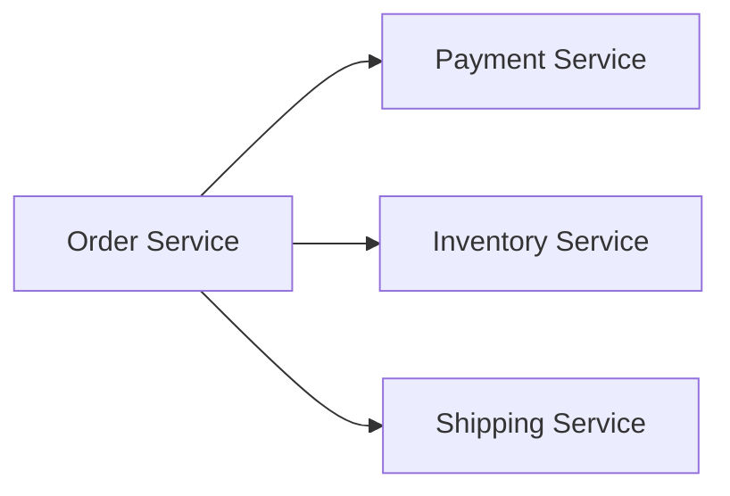
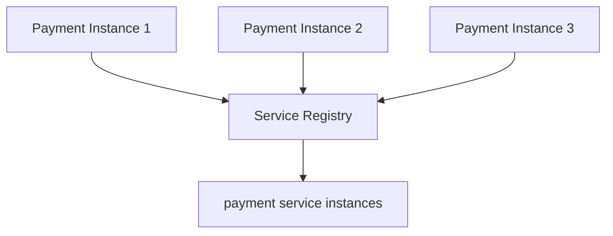
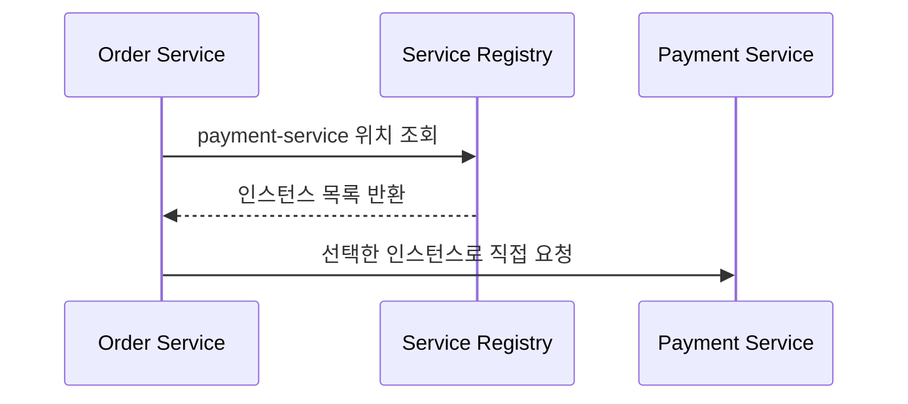
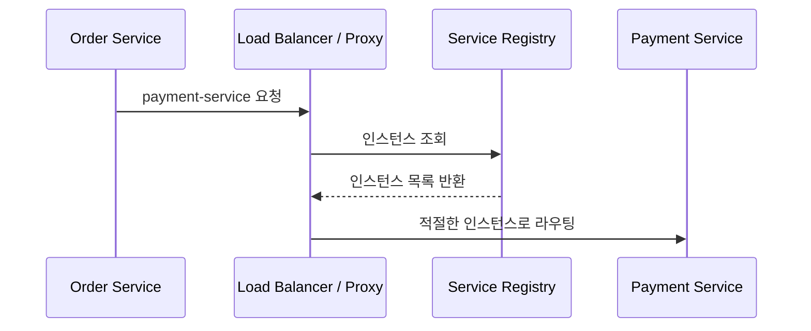
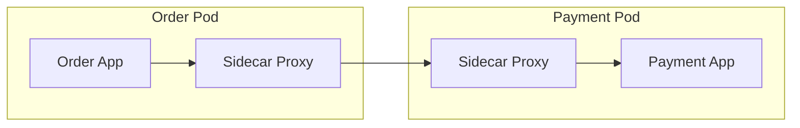
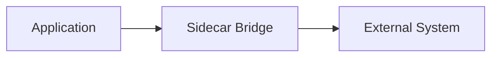
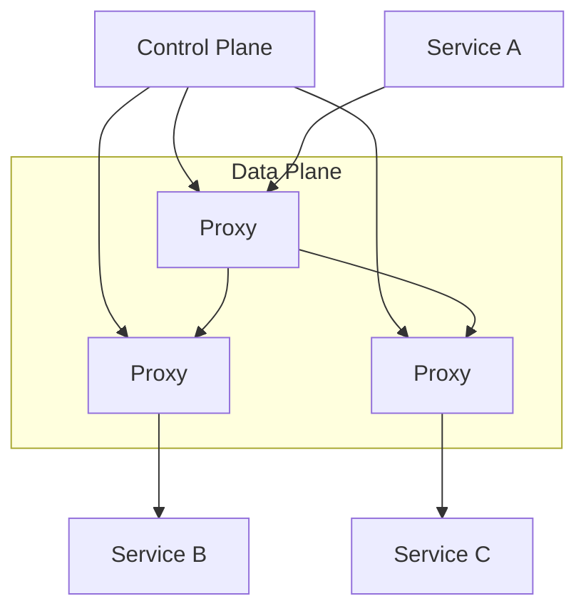
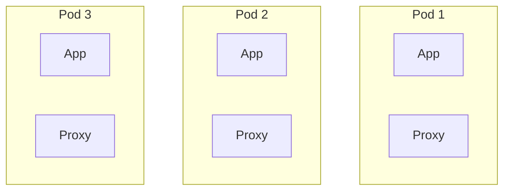
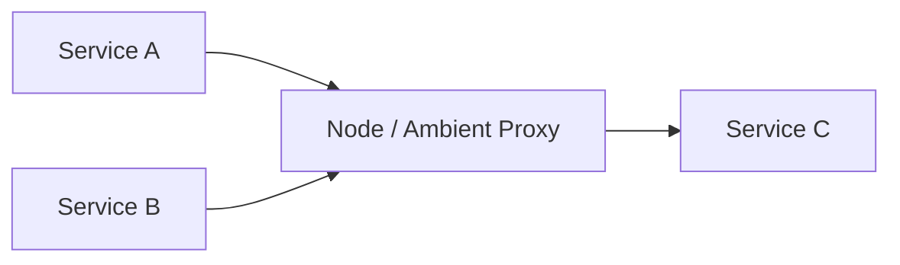

## 🥑 들어가며

MSA 환경에서는 하나의 큰 애플리케이션을 여러 서비스로 나누어 운영한다.
서비스가 나뉘면 각 서비스는 독립적으로 배포되고 확장될 수 있지만, 동시에 서비스 간 통신을 어떻게 안정적으로 처리할 것인지가 중요한 문제가 된다.

단일 애플리케이션 안에서는 메서드 호출로 끝나던 일이 MSA에서는 네트워크 호출이 된다.
네트워크 호출은 실패할 수 있고, 느려질 수 있고, 대상 서비스의 위치도 계속 바뀔 수 있다.
특히 컨테이너와 Kubernetes 환경에서는 Pod가 생성되고 사라지면서 IP가 계속 바뀌기 때문에, 클라이언트가 특정 IP를 직접 알고 호출하는 방식은 유지하기 어렵다.

그래서 MSA에서는 다음과 같은 질문이 생긴다.

- 호출할 서비스의 위치를 어떻게 찾을 것인가?
- 장애가 발생했을 때 어떻게 우회하거나 빠르게 실패시킬 것인가?
- 인증, 암호화, 로깅, 메트릭 수집 같은 공통 기능을 어디에서 처리할 것인가?
- 이런 기능을 모든 애플리케이션 코드에 반복해서 넣어야 하는가?

이번 글에서는 이 질문들이 `Service Registry`, `Service Discovery`, `Sidecar Proxy`, `Sidecar Bridge`, `Service Mesh`, `Sidecarless Service Mesh`로 어떻게 이어지는지 정리해보려 한다.

<br>

## MSA에서 서비스 간 통신이 어려운 이유

MSA에서는 서비스가 여러 개의 프로세스로 분리된다.
예를 들어 주문 서비스가 결제 서비스, 재고 서비스, 배송 서비스를 호출한다고 생각해보자.



이 구조에서 서비스 간 통신은 단순히 HTTP 요청을 보내는 것처럼 보일 수 있다.
하지만 운영 환경에서는 다음 문제가 생긴다.

- 서비스 인스턴스가 여러 개일 수 있다.
- 트래픽 증가에 따라 인스턴스가 늘거나 줄어든다.
- 장애가 난 인스턴스는 호출 대상에서 제외되어야 한다.
- 배포 중에는 구버전과 신버전 인스턴스가 함께 존재할 수 있다.
- 호출 지연, timeout, retry, circuit breaker 같은 정책이 필요하다.
- 어떤 서비스가 어떤 서비스를 호출했는지 추적해야 한다.

즉, MSA의 어려움은 서비스를 나누는 것 자체보다 나뉜 서비스들이 네트워크 위에서 안전하게 협력하도록 만드는 데 있다.

<br>

## Service Registry

`Service Registry`는 서비스 인스턴스의 위치 정보를 저장하는 저장소다.

서비스 인스턴스가 실행되면 자신의 정보를 registry에 등록한다.
반대로 인스턴스가 종료되거나 health check에 실패하면 registry에서 제거된다.

등록되는 정보는 보통 다음과 같다.

- service name
- instance id
- IP
- port
- health status
- metadata



예를 들어 `payment-service`라는 이름으로 세 개의 인스턴스가 떠 있다면, registry는 다음과 같은 정보를 알고 있다.

```text
payment-service
  - 10.0.1.10:8080 healthy
  - 10.0.1.11:8080 healthy
  - 10.0.1.12:8080 unhealthy
```

클라이언트는 더 이상 특정 IP를 하드코딩하지 않아도 된다.
대신 registry를 통해 현재 살아 있는 인스턴스 목록을 얻거나, registry와 연동된 discovery 체계를 통해 호출 대상을 찾는다.

Spring Cloud Netflix Eureka, Consul, ZooKeeper, Kubernetes Service와 DNS 등이 이런 역할을 수행할 수 있다.

<br>

## Service Discovery

`Service Discovery`는 클라이언트가 호출할 서비스의 실제 위치를 찾는 과정이다.

Registry가 서비스 위치 정보를 저장하는 곳이라면, Discovery는 그 정보를 이용해 호출 대상을 찾는 방식이라고 볼 수 있다.

Service Discovery 방식은 크게 두 가지로 나눌 수 있다.

<br>

## Client-side Discovery

`Client-side Discovery`에서는 클라이언트가 registry를 직접 조회한다.
클라이언트는 서비스 인스턴스 목록을 가져온 뒤, 그중 하나를 선택해서 직접 호출한다.



이 방식에서는 클라이언트가 다음 책임을 가진다.

- registry 조회
- load balancing
- retry
- timeout
- 장애 인스턴스 제외

장점은 구조가 비교적 단순하고, 클라이언트가 직접 호출 대상을 선택할 수 있다는 점이다.
하지만 호출 정책이 각 애플리케이션 코드나 라이브러리에 들어가기 쉽다.

서비스가 Java, Kotlin, Go, Node.js처럼 여러 언어로 작성되어 있다면 언어별로 동일한 discovery, retry, circuit breaker 정책을 맞추기 어려워진다.

<br>

## Server-side Discovery

`Server-side Discovery`에서는 클라이언트가 registry를 직접 조회하지 않는다.
클라이언트는 load balancer나 proxy로 요청을 보내고, 중간 계층이 registry를 조회해 적절한 인스턴스로 라우팅한다.



이 방식에서는 클라이언트가 서비스 위치를 몰라도 된다.
클라이언트는 고정된 endpoint만 바라보고, 실제 인스턴스 선택은 proxy나 load balancer가 담당한다.

Kubernetes의 Service가 대표적인 예다.
Pod IP는 계속 바뀔 수 있지만, 클라이언트는 `payment-service` 같은 Kubernetes Service 이름으로 호출한다.
Kubernetes 내부 DNS와 kube-proxy가 실제 Pod로 트래픽을 전달한다.

<br>

## Sidecar Proxy

Service Discovery만으로 모든 문제가 해결되지는 않는다.
서비스 간 호출에는 discovery 외에도 많은 공통 기능이 필요하다.

- retry
- timeout
- circuit breaker
- load balancing
- rate limiting
- mTLS
- 인증/인가
- access log
- metric
- distributed tracing

이 기능을 모든 애플리케이션에 직접 구현하면 중복이 커진다.
또한 언어나 프레임워크가 다르면 동일한 정책을 일관되게 적용하기 어렵다.

`Sidecar Proxy`는 이런 공통 네트워크 기능을 애플리케이션 밖으로 분리하기 위한 패턴이다.

Sidecar는 애플리케이션 컨테이너와 함께 배포되는 보조 컨테이너다.
Kubernetes에서는 보통 하나의 Pod 안에 애플리케이션 컨테이너와 proxy 컨테이너를 함께 둔다.



애플리케이션은 원래 하던 것처럼 요청을 보낸다.
하지만 실제 네트워크 트래픽은 sidecar proxy를 거쳐 나가고, 상대 서비스에서도 sidecar proxy를 거쳐 애플리케이션으로 들어간다.

이렇게 하면 애플리케이션 코드는 비즈니스 로직에 집중하고, 네트워크 공통 기능은 proxy가 처리할 수 있다.

<br>

## Sidecar Bridge

`Sidecar Bridge`는 애플리케이션과 외부 시스템 사이에 있는 통신 차이를 sidecar가 흡수하는 패턴으로 볼 수 있다.

예를 들어 애플리케이션은 단순한 HTTP API만 호출하고 싶지만, 실제 외부 시스템은 gRPC, message queue, legacy TCP protocol, 인증 토큰 갱신, connection pool 관리 같은 복잡한 방식을 요구할 수 있다.

이때 sidecar가 bridge 역할을 하면 애플리케이션은 단순한 인터페이스만 바라볼 수 있다.



Sidecar Bridge가 맡을 수 있는 역할은 다음과 같다.

- protocol 변환
- 인증 토큰 관리
- connection pool 관리
- legacy system 호출 방식 캡슐화
- 공통 에러 처리
- logging, metric 수집

즉, Sidecar Proxy가 주로 서비스 간 네트워크 트래픽 제어에 초점을 둔다면, Sidecar Bridge는 애플리케이션과 특정 외부 시스템 사이의 통신 복잡도를 감추는 데 초점을 둔다.

둘 다 애플리케이션 밖으로 공통 관심사를 분리한다는 점에서는 같다.

<br>

## Service Mesh

Sidecar Proxy가 서비스 하나의 네트워크 기능을 분리하는 패턴이라면, `Service Mesh`는 여러 서비스의 sidecar proxy를 하나의 네트워크 계층으로 관리하는 패턴이다.

서비스 메시에서는 애플리케이션 간 트래픽이 proxy를 통해 흐른다.
이 proxy들의 집합을 `Data Plane`이라고 부른다.
그리고 이 proxy들에게 정책과 설정을 내려주는 관리 계층을 `Control Plane`이라고 부른다.



Service Mesh의 핵심은 서비스 간 통신을 애플리케이션 코드가 아니라 인프라 계층에서 다룬다는 점이다.

대표적으로 다음 기능을 제공한다.

- 서비스 간 mTLS
- traffic routing
- canary release
- retry, timeout, circuit breaker
- fault injection
- rate limiting
- access log
- metric
- distributed tracing
- policy enforcement

예를 들어 특정 서비스의 10% 트래픽만 새 버전으로 보내거나, 특정 요청에 timeout 정책을 적용하거나, 서비스 간 통신을 mTLS로 암호화하는 일을 애플리케이션 코드 수정 없이 처리할 수 있다.

Istio, Linkerd, Consul Connect 같은 도구들이 Service Mesh를 구현한다.

<br>

## Service Mesh가 해결하는 문제

서비스 메시가 필요한 이유는 단순히 proxy를 붙이기 위해서가 아니다.
핵심은 서비스 간 통신 정책을 애플리케이션 코드에서 분리하고, 전체 시스템에 일관되게 적용하기 위해서다.

<br>

## 1. 공통 기능의 중복 제거

서비스마다 retry, timeout, circuit breaker, metric 코드를 직접 넣으면 중복이 발생한다.
또한 서비스마다 구현 방식이 조금씩 달라질 수 있다.

Service Mesh를 사용하면 이런 정책을 proxy 계층에서 공통으로 처리할 수 있다.

<br>

## 2. 언어와 프레임워크 독립성

MSA에서는 모든 서비스가 같은 언어로 작성되지 않을 수 있다.
Java 서비스는 Resilience4j를 쓰고, Go 서비스는 다른 라이브러리를 쓰고, Node.js 서비스는 또 다른 방식으로 retry를 구현할 수 있다.

이런 경우 동일한 네트워크 정책을 맞추기 어렵다.
Service Mesh는 애플리케이션 밖에서 동작하므로 서비스 구현 언어와 관계없이 같은 정책을 적용할 수 있다.

<br>

## 3. 관찰 가능성

서비스가 많아지면 장애 지점을 찾기 어렵다.
요청 하나가 여러 서비스를 거쳐 실패했을 때, 어디에서 지연이 생겼는지 알 수 있어야 한다.

Service Mesh는 proxy를 통과하는 트래픽을 기반으로 metric, log, trace를 수집할 수 있다.
이를 통해 서비스 간 호출 관계와 지연, 에러율을 더 쉽게 파악할 수 있다.

<br>

## 4. 보안

내부 서비스 간 통신도 안전하다고 가정하면 안 된다.
Service Mesh는 서비스 간 mTLS를 적용해 트래픽을 암호화하고, 서비스 identity를 기반으로 접근 정책을 제어할 수 있다.

애플리케이션마다 인증서 발급, 갱신, 검증 로직을 직접 구현하지 않아도 되는 점이 중요하다.

<br>

## Sidecar 기반 Service Mesh의 한계

Sidecar 기반 Service Mesh는 강력하지만 비용도 있다.
모든 Pod에 proxy 컨테이너가 추가되기 때문이다.



대표적인 한계는 다음과 같다.

- Pod마다 proxy가 추가되어 CPU, memory 사용량이 증가한다.
- proxy 설정과 lifecycle을 함께 관리해야 한다.
- 애플리케이션 트래픽이 proxy를 한 번 더 거치므로 latency가 증가할 수 있다.
- sidecar injection, upgrade, debugging이 운영 복잡도를 높인다.
- 작은 규모의 서비스에는 과한 구조가 될 수 있다.

따라서 Service Mesh는 기능이 많다는 이유만으로 도입하기보다, 실제로 서비스 간 통신 정책을 중앙에서 일관되게 관리해야 하는 요구가 있는지 먼저 봐야 한다.

<br>

## Sidecarless Service Mesh

`Sidecarless Service Mesh`는 서비스마다 sidecar proxy를 붙이지 않고, 서비스 메시의 기능을 제공하려는 접근이다.

sidecar를 없애면 Pod마다 proxy를 실행하지 않아도 되므로 resource overhead와 운영 복잡도를 줄일 수 있다.



Sidecarless 방식은 구현체마다 구조가 다르다.
예를 들어 node 단위의 proxy를 사용하거나, CNI/eBPF를 활용해 트래픽을 가로채거나, L4와 L7 처리를 분리하는 방식이 있다.

중요한 방향은 같다.

- 애플리케이션 Pod에 sidecar를 주입하지 않는다.
- 공통 네트워크 정책은 애플리케이션 밖에서 처리한다.
- sidecar 기반 mesh의 resource overhead를 줄인다.
- mesh 도입과 운영 부담을 낮춘다.

Istio Ambient Mesh는 sidecarless service mesh 흐름의 대표적인 예로 볼 수 있다.
기존 Istio는 Pod마다 Envoy sidecar를 주입하는 방식이 일반적이었지만, Ambient Mesh는 sidecar 없이 mesh 기능을 제공하는 방향으로 발전했다.

<br>

## Sidecar Mesh와 Sidecarless Mesh 비교

| 구분 | Sidecar 기반 Mesh | Sidecarless Mesh |
| --- | --- | --- |
| Proxy 위치 | 각 Pod 내부 | Node 또는 별도 계층 |
| Pod 변경 | sidecar injection 필요 | sidecar injection 불필요 |
| 리소스 사용 | Pod마다 proxy 비용 발생 | proxy 수를 줄일 수 있음 |
| 트래픽 제어 | 세밀한 L7 제어에 강함 | 구현 방식에 따라 L4/L7 분리 |
| 운영 복잡도 | sidecar lifecycle 관리 필요 | sidecar 관리 부담 감소 |
| 대표 예 | Istio sidecar mode, Linkerd | Istio Ambient Mesh 등 |

Sidecarless Mesh가 항상 더 좋은 것은 아니다.
Sidecar 방식은 서비스 단위로 proxy가 붙기 때문에 트래픽 제어와 격리가 명확하다.
반면 sidecarless 방식은 운영 부담을 줄일 수 있지만, 구현체의 성숙도와 지원 기능을 확인해야 한다.

결국 선택 기준은 다음과 같다.

- 서비스 수가 얼마나 많은가?
- 서비스 간 보안 정책이 필요한가?
- L7 routing, canary, retry 같은 기능이 필요한가?
- sidecar의 resource overhead를 감당할 수 있는가?
- 운영팀이 mesh를 이해하고 디버깅할 수 있는가?

<br>

## 전체 흐름 정리

지금까지의 개념은 서로 별개의 기술처럼 보이지만, 사실은 같은 문제에서 출발한다.

> MSA 환경에서 서비스 간 통신을 어떻게 안정적이고 일관되게 관리할 것인가?

이 질문에 대한 답이 단계적으로 발전한 흐름은 다음과 같다.


각 개념의 역할을 짧게 정리하면 다음과 같다.

| 개념 | 역할 |
| --- | --- |
| Service Registry | 서비스 인스턴스 위치와 상태를 저장한다. |
| Service Discovery | 호출할 서비스 인스턴스를 찾는다. |
| Sidecar Proxy | 서비스 간 네트워크 공통 기능을 애플리케이션 밖으로 분리한다. |
| Sidecar Bridge | 애플리케이션과 외부 시스템 사이의 통신 복잡도를 감춘다. |
| Service Mesh | 여러 proxy를 하나의 통신 계층으로 관리한다. |
| Sidecarless Service Mesh | sidecar 없이 mesh 기능을 제공해 overhead를 줄인다. |

<br>

## 마무리

MSA에서는 서비스가 작게 나뉘는 만큼 서비스 간 통신 문제가 커진다.
처음에는 서비스 위치를 찾기 위해 Service Registry와 Service Discovery가 필요해진다.
이후 retry, timeout, circuit breaker, mTLS, metric, tracing 같은 공통 기능이 늘어나면 Sidecar Proxy와 Service Mesh가 등장한다.

하지만 Service Mesh는 만능 해결책이 아니다.
Sidecar 기반 mesh는 강력하지만 resource overhead와 운영 복잡도를 가진다.
그래서 최근에는 sidecarless service mesh처럼 mesh의 장점은 유지하면서 부담을 줄이려는 방식도 함께 등장하고 있다.

결국 중요한 것은 도구 이름이 아니라 현재 시스템이 겪는 문제다.
서비스 위치 관리가 문제인지, 장애 전파 차단이 문제인지, 보안 정책이 문제인지, 관찰 가능성이 문제인지 먼저 봐야 한다.
그 문제를 기준으로 Service Discovery, Sidecar, Service Mesh, Sidecarless Mesh 중 적절한 수준의 구조를 선택하는 것이 좋다.
